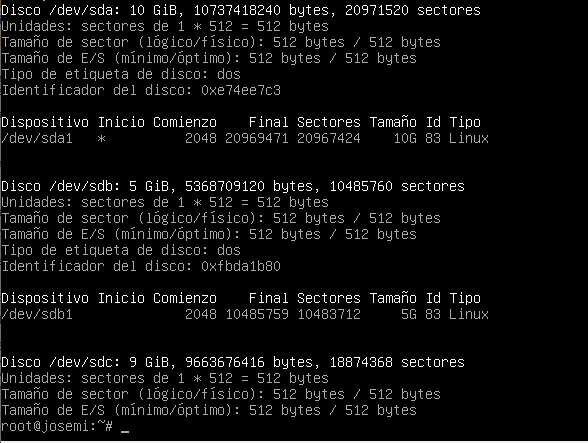

## FSTAB

## CRONTAB:

- Cada hora en punto ejecutamos la sincronización horaria y mandamos la salida a /dev/null/
~~~
* * * * * root ntpdate -u hora.roa.es > /dev/null/
~~~

- Programar un trabajo (A) para ejecutarse en el minuto 30 de cada hora de cada día.
~~~
30 * * * * /etc/trabajos/trabajos.sh
~~~

- Programar un trabajo (B) para ejecutarse cada día a las 20:30h.
~~~
30 20 * * * /etc/trabajos/trabajos.sh
~~~

- Programar un trabajo (C) para ejecutarse de lunes a viernes a las 20:30h.
~~~
30 20 * * 1-5 /etc/trabajos/trabajos.sh
~~~

- Programar un trabajo (D) para ejecutarse los martes y los jueves a las 20:30h.
~~~
30 20 * * 2,4 /etc/trabajos/trabajos.sh
~~~

- Programar un trabajo (E) para ejecutarse los días 10 y 20 de todos los meses a las 20:30h.
~~~
30 20 10,20 * * /etc/trabajos/trabajos.sh
~~~

- Programar un trabajo (F) para ejecutarse cada 15 minutos.
~~~
*/15 * * * *  /etc/trabajos/trabajos.sh
~~~

- Programar un trabajo (G) para ejecutarse cada día a las 00:00h.
~~~
@daily /etc/trabajos/trabajos.sh
~~~

- Programar un trabajo (H) para ejecutarse cada primer día de mes a las 00:00h.
~~~
@mountly /etc/trabajos/trabajos.sh
~~~
